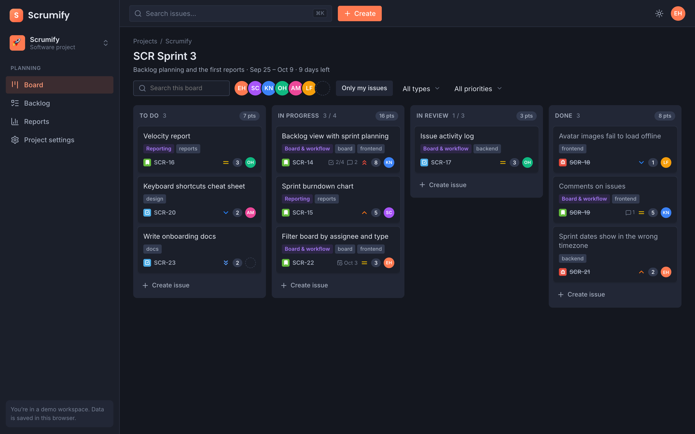
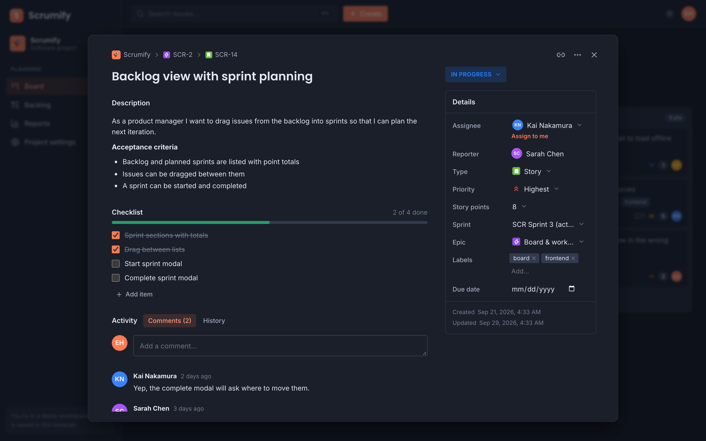
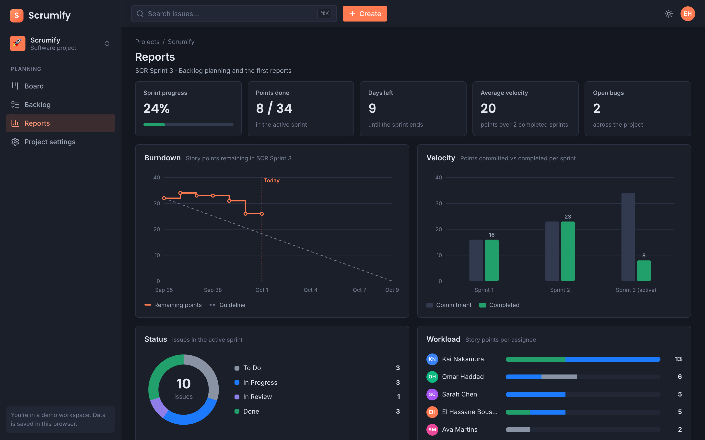

<div align="center">

# 🚀 Scrumify

**A Jira-style Scrum board: sprints, backlog, issues and reports, in the browser.**

[](https://nextjs.org)
[](https://react.dev)
[](https://www.typescriptlang.org)
[](https://sass-lang.com)
[](https://zustand.docs.pmnd.rs)
[](https://dndkit.com)
[](LICENSE)
<br />
[](https://github.com/boushib/scrumify/commits/main)
[](https://github.com/boushib/scrumify)
[](https://github.com/boushib/scrumify)



</div>

## Screenshots

**Issue details:** Markdown description, checklist, comments and every field editable in place



**Reports:** burndown, velocity, status and workload



## About

_Scrumify_ is a Scrum project management tool in the spirit of _Jira_, built with **Next.js 16** (App Router), **React 19** and **TypeScript**. It started as a job interview exercise and has grown into a full sprint planning app.

Everything runs in the browser: the workspace (projects, sprints, issues and their history) lives in a [zustand](https://github.com/pmndrs/zustand) store saved to `localStorage`, and ships with demo data so every screen has something to show.

Demo: https://scrumify.onrender.com/

## Features

### Board
- Columns for the active sprint's statuses; drag cards between and within columns with the mouse, touch or keyboard ([dnd-kit](https://dndkit.com/)), and the order is kept
- Filter by text, assignee avatars, type, priority or "Only my issues"
- Create issues inline at the bottom of any column
- Story point totals per column and WIP limit warnings
- Sprint goal, dates and days left in the header; an empty state links to the backlog when no sprint is active

### Backlog and sprints
- Active sprint, planned sprints and the backlog in one list, with issue counts and to do / in progress / done point totals
- Drag issues between sprints and the backlog, change status inline, and create issues in any section
- Create, edit, start (duration, dates and goal), complete (choose where open issues go) and delete sprints

### Issues
- Issue dialog at `?issue=KEY`, so every issue has a shareable link and opens from any page
- Inline editing of the summary and a Markdown description (headings, lists, bold, italic, code, links)
- Status, assignee, reporter, type, priority, story points, sprint, epic, labels and due date
- Checklists with progress, comments (add, edit, delete), and a full change history
- Epics list their child issues
- Copy link, and delete with undo

### Reports
- Burndown for the active sprint, replayed from each issue's status history, with the guideline, a today marker and hover details
- Velocity: committed vs completed points for recent sprints
- Status breakdown, points per assignee, and summary cards (progress, days left, average velocity, open bugs)

### Projects
- Several projects, each with its own key (`SCR-12`), icon, color, lead and board columns
- Create projects with a suggested unique key; switch between them from the sidebar
- Settings: details, board columns (rename, category, WIP limit, reorder, add, delete) and deleting a project

### Everywhere
- Command palette (<kbd>⌘</kbd> <kbd>K</kbd> or <kbd>/</kbd>) to search issues across projects, jump to projects and run actions
- Keyboard shortcuts: <kbd>C</kbd> create issue, <kbd>G</kbd> then <kbd>B</kbd>/<kbd>L</kbd>/<kbd>R</kbd>/<kbd>S</kbd>/<kbd>P</kbd> to navigate, <kbd>?</kbd> for the full list
- Light and dark themes, applied before first paint so there's no flash; switching grows the new theme out of the toggle in a circle
- Motion throughout: pages fade in, cards and rows cascade in, dragged cards lift and tilt, menus and toasts spring open, and report charts draw themselves. All of it is turned off when the OS asks for reduced motion
- Toast notifications, with undo where it matters
- Responsive: a navigation drawer, condensed top bar and swipeable board columns on phones
- Reset the demo data from the account menu

## Getting started

Requires Node.js 20.9+ and pnpm.

```bash
pnpm install
pnpm dev
```

Open [http://localhost:3000](http://localhost:3000).

| Script | What it does |
| --- | --- |
| `pnpm dev` | Dev server with Turbopack |
| `pnpm build` / `pnpm start` | Production build and server |
| `pnpm lint` | ESLint (flat config) |
| `pnpm typecheck` | TypeScript, no emit |
| `pnpm dev:agent` / `pnpm build:agent` | Dev server on port 3300 and build, both with a separate `.next-agent` output, so a second server doesn't clash with yours |

## Project structure

```
src/
  app/            Routes: /projects, and /board, /backlog, /reports, /settings with ?project=KEY
  views/          One folder per page (Board, Backlog, Reports, Settings, Projects)
  components/     Issue dialog, create dialog, command palette, shortcuts, filters, Markdown, UI kit
  layout/         App shell, sidebar and top bar
  store/          Workspace store (persisted), selectors and transient UI state
  data/seed.ts    Demo workspace
  lib/            Ranking, reports maths, formatting
  models/         Types for projects, sprints, issues and activity
```

- The app renders only in the browser (behind a short loading screen) because all data comes from `localStorage`.
- Issues are ordered with fractional ranks, so a drag rewrites one issue instead of renumbering a whole column.
- Every tracked field change is logged as activity; reports and the history tab are built from that log.

## Roadmap

- Sub-tasks and issue links (blocks, relates to, duplicates)
- Swimlanes on the board (by assignee or epic) and a timeline view for epics
- Saved filters and a JQL-like search syntax
- Attachments and @mentions in comments
- A real backend with accounts, shared workspaces and live updates

## License

[MIT](LICENSE) © El Hassane Boushib
